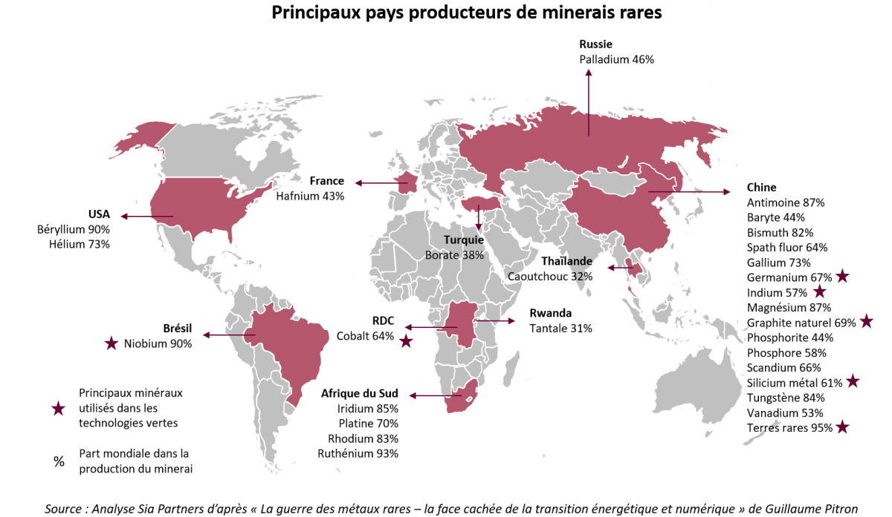
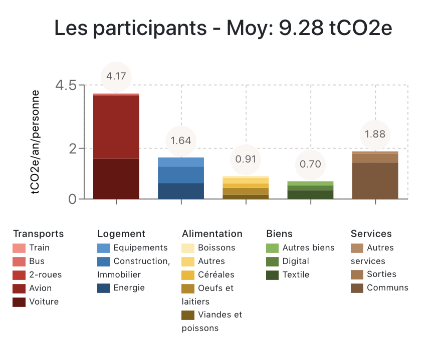
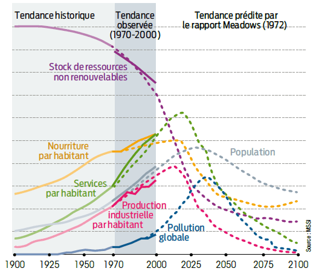
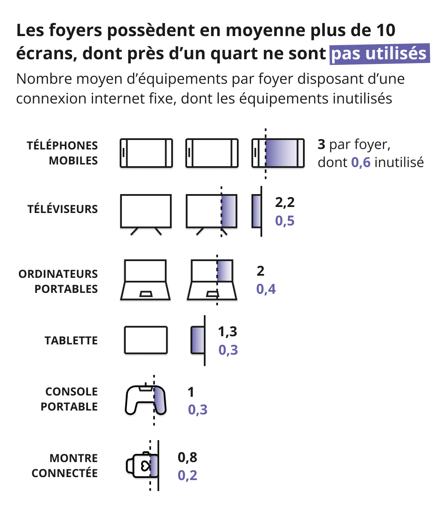

<!-- truncate -->

# Numérique responsable

## L'empreinte écologie et sociale du Numérique

### Le cycle de vie d'un objet numérique

Par exemple une tablette, un smartphone ...

#### 1- Extraction des matières

L'extraction des matières première est issue des mines.

Cette extraction peut provoquer des conflits armés, on parle de **Minerai de sang** (Etain, Tantale, Or, Tungstène)
en RDC (~6millions de morts), Grands lacs, Birmanie, Amérique centrale.

Il y a 2 types de mines:

- **Artisanale** (travail des enfants, conditions déplorables de travail pour la santé et l'environnement ...)
- **Industriel** (sociétés occidentales qui viennent exploiter les ressources, ne profite pas aux populations)

#### 2 - Traitement

Extraction des terres rares (pas forcément rares)
Certaines matières sont plus ou moins présente dans la roche, pour l'extraire
il faut utiliser des procédés lourds faisant appel à la chimie, une grande quantité d'eau et d'énergie ...
ce qui produit des déchets extrêmement toxiques, néfaste pour la santé et l'environnement (Baotou en Chine).

#### 3 - Fabrication

Quasi-monopole au départ où tout se passait à Taïwan, depuis la crise sanitaire (covid 2019) et la pénurie qui en a
découlé,
d'autres pays sont rentré dans l'industrie
C'est une industrie qui consomme énormément d'eau.

- Taïwan : TSMC c'est 150 000t d'eau / jour
  Même s'il pleut 2x plus qu'au Finistère. Cette industrie crée un stress hydrique, il n'y
  a plus assez d'eau pour les besoins primaires et les cultures.

#### 4 - Assemblage

Usine de production de Foxconn en Chine

Les travailleurs travaillent 12h/j, debout, à la chaîne et sans syndicat.
Une partie de ces travailleurs est issue de l'imigration
Salaire minimum moindre que le salaire nécessaire pour vivre

#### 5 - Utilisation

Nous vivons dans une société qui a effectué sa transition numérique

##### Fracture numérique:

- 1er degré: pas d'équipement pour avoir accès au réseau
- 2ème degré: illectronisme (qui ne savent/veux/peux pas utiliser le numérique: personnes agées), abandonnisme (19% en
  France)

  Autre exemple des jeunes qui autant passe sa journée à zapper sur des vidéos de chat, mais est incapable de
  faire des démarches administrative (CAF, Sécu, Impôt...)

##### Conséquences sur la santé:

- Trouble de l'attention
- Anxiété
- Addiction
- Burn-out
- Manque de mouvements

##### Conséquences sur la vie sociale:

- Désociabilisation
- Cyberharcèlement
- Désinformation
- Complotisme

##### Egalité Femme-Homme:

- 15% de Femmes dans les profils techniques et ingénieurs
- 1 femme / 2 quitte la Tech avant ses 35 ans

##### Accessibilité numérique:

- +90% des services numériques ne sont pas accessibles

##### Les travailleurs du clic

Des entreprises (plateforme d'IA par exemple) qui ont besoin de faire de petites tâches qui nécessite de l'intelligence
humaine
(détection de panneau dans une image...)

Des personnes sans travail, pauvre peuvent choisir de gagné un peux d'argent avec ces micro tâches rémunérées

Travail uberisé, sans cotisation, sans couverture, horaires libres ...

#### Impact Carbon

#### Le mix énergétique de la France

Globalement peux carbonné comparer à certains pays (Allemagne
Charbon) => [https://app.electricitymaps.com](https://app.electricitymaps.com/map/72h/hourly)

:::warning
Energie renouvable ne veux pas forcement dire bas carbon (biomass)
:::

#### 5 - Fin de vie

- DEEE: Déchets d'Equipements Electriques et Electroniques
- Recyclage très difficile et très énergivore (perte de qualité du produit comparé à celui qui sort de la mine)
- Export illégal des DEEE

## Quiz

  

De combien de métaux différents sont constitués nos
smartphones ?

1. 10 à 30
2. 30 à 50
3. 50 à 70
4. 70 à 90

**Réponse:** 3

  

Quel est le poids de matière utilisée pour créer 1kg de
smartphone (environ 7 smartphones) ?

1. 100kg
2. 400kg
3. 800kg
4. 1200kg

**Réponse:** 4

### Conséquence sur le climat

Accord de Paris en 2015

:::note
« Maintenir l'augmentation de la température moyenne
mondiale bien en dessous de 2°C au-dessus des niveaux
préindustriels
et de poursuivre les efforts pour limiter l'augmentation de la
température à 1,5°C au-dessus des niveaux préindustriels. »
:::

[https://www.2tonnes.org/](https://fresqueduclimat.org/)

[https://fresqueduclimat.org/](https://fresqueduclimat.org/)

Empreinte carbone moyenne de la population (France) : **9.41 tCO2e/an**

Source: [https://www.wiserimpact.com/atelier-2tonnes/](https://www.wiserimpact.com/atelier-2tonnes/)

[barometre-du-numerique](https://www.arcep.fr/cartes-et-donnees/nos-publications-chiffrees/barometre-du-numerique/le-barometre-du-numerique-edition-2025.html)

  

Qu'est ce qui est le plus impactant ?

1. La conception
2. La fabrication
3. La distribution
4. L'utilisation

**Réponse:** 2

  

Qu'est ce qui est le plus impactant ?

1. Les terminaux utilisateur
2. Les équipements des réseaux fixes et mobiles
3. Les équipements des datacenters

**Réponse:** 1

Un utilisateur peut avoir plusieurs terminaux (TV, Smartphone...) et il y a plusieurs millions d'utilisateurs
par conséquent les utilisateurs et leur(s) équipement(s) impactent plus que les équipements d'un datacenter par
exemple.

#### The Shift Project

https://theshiftproject.org/thematiques/numerique/

Chiffres clés sur le numérique

| 3 à 4%                                                                                                          | 1/10                                                                           | 3/4                                                                                                                                | 90%                                                                                                                                                                                       | 
|-----------------------------------------------------------------------------------------------------------------|--------------------------------------------------------------------------------|------------------------------------------------------------------------------------------------------------------------------------|-------------------------------------------------------------------------------------------------------------------------------------------------------------------------------------------|
| des émissions mondiales de gaz à effet de serre sont liées au numérique, avec une croissance annuelle de + 6 %. | de la consommation électrique mondiale est liée aux flux du secteur numérique. | du trafic Internet est lié à de la vidéo. En 2018, la vidéo en ligne type streaming représentait 60% du trafic mondial de données. | de l'impact carbone d'un smartphone vient de sa production, mais la phase d'utilisation représente la moitié des émissions du numérique mondial, une fois tous les effets pris en compte. | 

#### Le club de Rome: Rapport Meadows (1972)

Certain poste vont atteindre leur pic comme la production de nourriture, les services par personne, la production
industrielle par personne
pour ensuite baisser. Vivant dans une société basé sur des postes en augmentation, comment repenser le système
de production, d'éducation et de consommation par rapport à cette baisse.

### Le baromètre du numérique

:::note
En 2023, la moyenne par foyer est de 10 équipements numériques, utilisés ou non
Le Baromètre du numérique interroge les utilisateurs sur les équipements numériques qu’ils possèdent.
Les résultats de cette édition révèlent que chaque foyer dispose en 2023 en moyenne de 10 équipements numériques avec
écrans,
utilisés ou non utilisés, soit environ 300 millions d’équipements numériques en France métropolitaine.

Sur l’ensemble des terminaux présents au sein d’un foyer, un quart sont conservés sans être utilisés : environ 70
millions
d’appareils seraient donc susceptibles d’être reconditionnés ou recyclés.
:::

Source: https://www.arcep.fr/cartes-et-donnees/nos-publications-chiffrees/barometre-du-numerique/le-barometre-du-numerique-edition-2023.html

