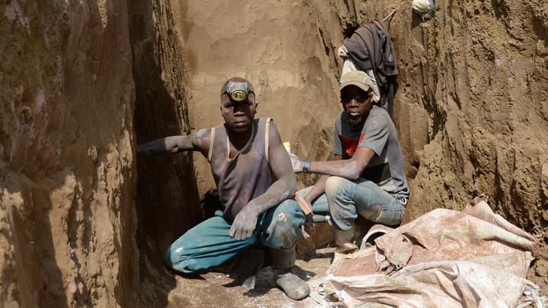

<!-- truncate -->

# Numérique responsable

## L'empreinte écologie et sociale du Numérique
### Le cycle de vie d'un objet numérique
Par exemple une tablette, un smartphone ...

#### 1- Extraction des matières
L'extraction des matières première est issue des mines. 

Cette extraction peut provoquées des conflits armés, on parle de **Minerais de sang** (Etain, Tantale, Or, Tungstène)
en RDC (~6millions de morts), Grands lacs, Birmanie, Amérique centrale

Il y a 2 types de mines:
- **Artisanale** (travail des enfants, conditions déplorable de travail pour la santé et l'environnement ...)
- **Industriel** (sociétés occidentales qui viennent exploiter les ressources, ne profite pas au population)

#### 2 - Traitement
Extraction des terres rares (pas forcement rares)
Certaines matières sont plus ou moins présente dans la roche, pour extraire 
il faut utiliser des procéder chimiques, de l'eau, de l'énergie ... ce qui produit des déchets extrêmement toxiques
Néfaste pour la santé et l'environnement (Baotou en Chine)

#### 3 - Fabrication
Quasi monopole ou tout se passait à Taïwan, depuis la crise sanitaire (covid 2019) et la prénurie d'autres pays 
sont rentré dans l'industrie
C'est une industrie qui consomme énormement d'eau
- Taïwan : TSMC c'est 150 000t d'eau / jour
Même s'il pleut 2x plus qu'au Finistère cette industrie crée un stress hydrique, la conséquence étant qu'il n'y
à plus assez d'eau pour les besoins primaires et les cultures

#### 4 - Assemblage
Usine de production de Foxconn en Chine

Les travailleurs travaillent 12h/j, debout, à la chaîne et sans syndicat.
Une partie de ces travailleurs est issue de l'imigration
Salaire minimum moindre que le salaire nécessaire pour vivre

#### 5 - Utilisation
Nous vivons dans une société qui a effectué sa transition numérique

##### Fracture numérique:
- 1er degré: pas d'équipement pour avoir accès au réseau
- 2ème degré: illectronisme (qui ne savent/veux/peux pas utiliser le numérique: personnes agées), abandonnisme (19% en France)
  
  Autre exemple des jeunes qui autant passe sa journée à zapper sur des vidéos de chat, mais est incapable de 
  faire des démarches administrative (CAF, Sécu, Impôt...)

##### Conséquences sur la santé:
- Trouble de l'attention
- Anxiété
- Addiction
- Burn-out
- Manque de mouvements

##### Conséquences sur la vie sociale:
- Désociabilisation
- Cyberharcèlement
- Désinformation
- Complotisme

##### Egalité Femme-Homme:
- 15% de Femmes dans les profils techniques et ingénieurs
- 1 femme / 2 quitte la Tech avant ses 35 ans

##### Accessibilité numérique:
- +90% des services numériques ne sont pas accessibles

##### Les travailleurs du clic
Des entreprises (plateforme d'IA par exemple) qui ont besoin de faire de petites tâches qui nécessite de l'intelligence humaine
(détection de panneau dans une image...)

Des personnes sans travail, pauvre peuvent choisir de gagné un peux d'argent avec ces micro tâches rémunérées

Travail uberisé, sans cotisation, sans couverture, horaires libres ...

#### Impact Carbon

#### Le mix énergétique de la France
Globalement peux carbonné  comparer à certains pays => [https://app.electricitymaps.com](https://app.electricitymaps.com/map/72h/hourly)

:::warning
Energie renouvable ne veux pas forcement dire bas carbon (biomass)
:::

#### 5 - Fin de vie
- DEEE: Déchets d'Equipements Electriques et Electroniques
- Recyclage très difficile et très énergivore (perte de qualité du produit comparé à celui qui sort de la mine)
- Export illégal des DEEE

## Quiz

  

De combien de métaux différents sont constitués nos
smartphones ?

1. 10 à 30
2. 30 à 50
3. 50 à 70
4. 70 à 90

**Réponse:** 3

  

Quel est le poids de matière utilisée pour créer 1kg de
smartphone (environ 7 smartphones) ?

1. 100kg
2. 400kg
3. 800kg
4. 1200kg

**Réponse:** 4

