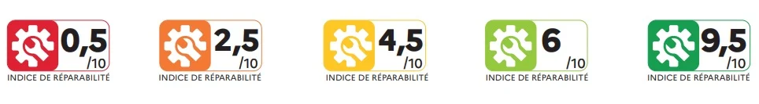

<!-- truncate -->

# La Responsabilité Sociétale des Entreprises (RSE)

## Définition de la RSE de la Commission Européenne

:::quote
« Un concept qui désigne l'intégration
volontaire, par les entreprises, de
préoccupations sociales et environnementales à
leurs activités commerciales et leurs relations
avec leurs parties prenantes »
::: 

### Exemple l'indice de responsabilité
Source: [https://www.economie.gouv.fr](https://www.economie.gouv.fr/particuliers/mes-droits-conso/bien-consommer/tout-savoir-sur-lindice-de-reparabilite#)

:::info
Ce qui change en 2025
À partir de 2025, l'indice de durabilité remplace progressivement l'indice de réparabilité pour certaines catégories de produits, à commencer par les téléviseurs (le 8 janvier) et les lave-linge - hublot et top - (le 8 avril). Il comprend de nouveaux critères, notamment relatifs à la fiabilité du produit.

[En savoir plus sur l'indice de durabilité](https://www.economie.gouv.fr/particuliers/tout-savoir-sur-lindice-de-durabilite)
:::

#### Comment est calculé l'indice de réparabilité ?
Le calcul de l'indice de réparabilité de chaque modèle de produits repose sur cinq critères.

- **Documentation** : score déterminé par l'engagement du producteur à rendre disponibles gratuitement, en nombre d'années, des documents techniques auprès des réparateurs et des consommateurs.
- **Démontabilité et accès, outils, fixations** : score déterminé par la facilité de démontage du produit, le type d'outils nécessaires et les caractéristiques des fixations.
- **Disponibilité des pièces détachées** : score déterminé par l'engagement du producteur sur la durée de disponibilité des pièces détachées et sur le délai de leur livraison.
- **Prix des pièces détachées** : score déterminé par le rapport entre le prix de vente des pièces détachées et le prix du produit.
- **Spécifiques** : score déterminé par des sous-critères propres à la catégorie de produits concernée.

L'indice de réparabilité résulte du calcul de ces scores par critères, ramené à une note sur 10.

## La norme ISO 26000
- la gouvernance de l'organisation,
- les droits de l'être humain,
- les relations et conditions de travail,
- l'environnement,
- la loyauté des pratiques,
- les questions relatives aux consommateurs,
- les communautés et le développement local.

## Les référentiels RG*
- **RGAA** : Accessibilité numérique
- **RGPD** : Protection des données personnelles
- **RGI** : Interopérabilité
- **RGS** : Sécurité
- **RGESN** : Écoconception numérique

## La règle des 3U
- **Utile**: Est-ce qu'on crée plus de valeur qu'on en détruit ?
- **Utilisable**: Utilisable par tous (connexion, handicap ...)
- **Utilisé**: "70% des fonctionnalités demandées par les utilisateurs ne sont pas essentielle et 45% ne sont jamais utilisées." — _Ecoconception Web, les 115 bonnes pratiques de Frédéric Bordage._

