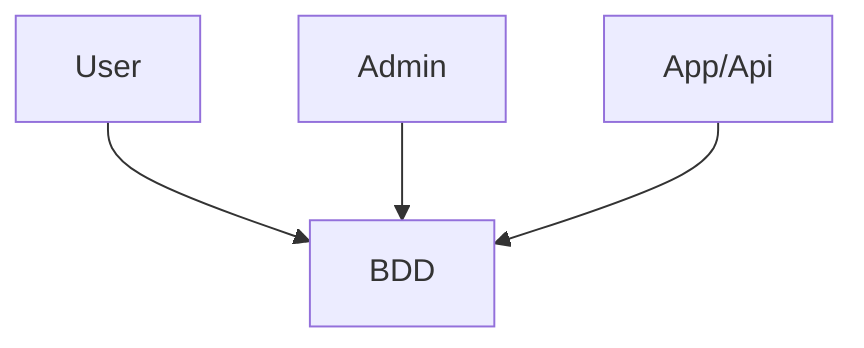

# SQLServer

**SGBD**: Système de Gestion de Base de Données

Une base de données (BDD) est un ensemble struturé et organisé de données.
Elle permet de stocker, gérer et récupérer des informations de manière efficace.

## Les formes normales
Un ensemble de règles/bonnes pratiques pour la conception d'une base de données.

### 1NF
Il faut que toutes les données soit décomposées de manière simple

Exemple : 
|id|phone|
| -- | -- |
|1| 0476343605 - 0606060606 |

Attendu:

|id|phone|mobile|
| -- | -- | -- |
|1| 0476343605 | 0606060606 |

### 2NF

Si la table est déjà en 1NF et que toutes les données dépendent de la PK
Par exemple si j'ai une commande avec des articles à m'intérieur et faut bien 
une table article, une table commande et une table qui joint les articles avec la 
commande.

### 3NF

Si la table est déjà en 2NF et que toutes les données dépendent de la PK
Par exemple si j'ai une commande avec des articles à m'intérieur et faut bien 
une table article, une table commande et une table qui joint les articles avec la 
commande.

#### Forme normale de Boyce-Codd (BCNF)
Forme plus stricte de la forme normale 3 (3NF)

### 4NF: 
### 5NF: 

## DDL: Data Definition Language
CREATE ALTER DROP

