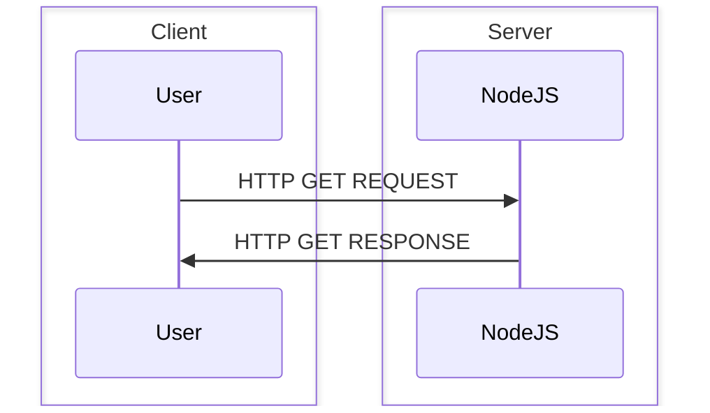
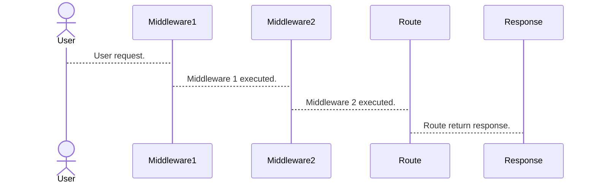

# Express 



## Qu'est-ce que c'est ?
[Express](https://expressjs.com/)

ExpressJS est un module qui rajoute une surcouche au module de base `node:http` de NodeJS qui permet de créer facilement une api/application web. En effet Express incorpore nativement un système de routing et de middleware.

## Exemple
```js title="server.js"
const express = require('express');

// Init
const app = express();
const port = 3000;

const users = [
    {id: 1, firstname: "test1", lastname: "test1", email: "test1@gmail.com", role: 'user'},
    {id: 2, firstname: "test2", lastname: "test2", email: "test2@gmail.com", role: 'user'},
    {id: 3, firstname: "test3", lastname: "test3", email: "test3@gmail.com", role: 'user'},
    {id: 4, firstname: "test4", lastname: "test4", email: "test4@gmail.com", role: 'user'},
    {id: 5, firstname: "admin1", lastname: "admin1", email: "admin1@gmail.com", role: 'admin'},
    {id: 6, firstname: "admin2", lastname: "admin2", email: "admin2@gmail.com", role: 'admin'},
];

// Routing/Handling
app.get('/', (req, res) => {
    res.send({
        "/users": {
            method: 'GET',
            description: "List users",
            url: `http://localhost:${port}/users` 
        },
        "/users/:id": {
            method: 'GET',
            description: "Get user informations",
            url: `http://localhost:${port}/users/:id`,
            params: {
                ':id': {
                    type: 'integer',
                    required: true
                }
            } 
        },
        "/users/role/admin": {
            method: 'GET',
            description: "List admin users",
            url: `http://localhost:${port}/users/role/admin` 
        },
        "/users/role/user": {
            method: 'GET',
            description: "List default users",
            url: `http://localhost:${port}/users/role/user` 
        },
    }) 
});

app.get('/users', (req, res) => {
    res.json(users);
});


app.get('/users/:id{}', (req, res) => {
    const id = Number.parseInt(req.params.id || "-1");
    const user = users.find((u) => u.id === id);

    if (user) {
        return res.json(user);
    }

    res.status(404).json({
        success: false,
    });
});

app.get('/users/role/:role{admin|user}', (req, res) => {
    const role = req.params.role;
    res.json(users.filter(u => u.role === role ));
});

// Start
app.listen(port, () => {
    console.log(`Example app listening on port ${port}`)
});
```

## Router

```js title="routes/router.js"
const router = require('express').Router();

router.get('/', (req, res) => {
    res.send('OK');
});

export {
    router
}
```

```js title="server.js"
import express from 'express';
import { router as defaultRouter } from './router.js' 

// Init
const app = express();
const port = 3000;

app.use(defaultRouter)
app.use('/group', defaultRouter)

app.listen(port, () => {
    console.log(`Example app listening on port ${port}`)
});
```

## Middleware

Une function qui s'exécute avant ou après l'appel de la route.

Cela permet par exemple de :
- Validation de données d'une requête (Joi/AJV)
- Validation des tokens/authentification (JWT)
- Gérer les logs
- ...

```js title="middlewares/not-found.middleware.js"
app.use((req, res, next) => {
    res.status(404).json({
        success: false,
        message: "Page not found"
    });
});
```




## Moteur de template
Il existe différents moteurs de template `ejs`, `pug`, `mustache`, `handlebars` ... 

Dans un contexte **Express**:

`app.set('view engine', 'ejs');`

`app.engine` => [Consolidate.js](https://github.com/tj/consolidate.js)

```ejs title='index.ejs'
<!DOCTYPE html>
<html lang="en">
<head>
    <meta charset="UTF-8">
    <meta name="viewport" content="width=device-width, initial-scale=1.0">
    <title>Document</title>
</head>
<body>

    <h1>Hello <%= username %></h1>
    
</body>
</html>
```

```js title="server.js"
// ...

app.set('view engine', 'ejs');

app.get('/', (req, res) => {
    res.render('index.ejs', { 
        username: 'tciles'
     });
});

// ...
```

## Soumission de données

```js title="server.cjs"
// ...

app.use(express.json());
app.use(express.urlencoded({ extended: false }));

// ...

const cities = [];

app.get('/cities', (req, res) => {
    res.render('index.ejs', { cities });
});

app.post('/cities/add', (req, res) => {
    const { name } = req.body;

    if (!name) {
        return res.status(422).render('index.ejs', { cities });
    }

    cities.push({ name });

    return res.redirect('/cities');
});

// ...
```

```ejs title="index.ejs"
<!DOCTYPE html>
<html lang="en">
<head>
    <meta charset="UTF-8">
    <meta name="viewport" content="width=device-width, initial-scale=1.0">
    <title>Document</title>
</head>
<body>
    <h2>Mes villes</h1>
    
    <form action="/cities/add" method="post">
        <div>
            <label for="name">Nom:</label>
            <input type="text" id="name" name="name">
        </div>

        <button type="submit">Envoyer</button>
    </form>

    <h2>Les villes</h2>
    <ul>
        <% for(let i = 0, l = cities.length; i < l; i++) { %>
            <li><%= cities[i].name %></li>
        <% } %>
    </ul>
</body>
</html>
```

## Validation des données

La validation des données est importante:
- Permet d'éviter les erreurs de saisies
- Se prémunir d'attaques malveillantes comme la XSS
- Améliorer la qualité d'utilisation

Librairies existantes:
- Joi: [https://github.com/hapijs/joi](https://github.com/hapijs/joi)
- AJV: [https://github.com/ajv-validator/ajv](https://github.com/ajv-validator/ajv)
- express-validator: [https://github.com/express-validator/express-validator](https://github.com/express-validator/express-validator)


### Exemple avec express-validator

Installation

```sh
npm i express-validator
```

Ajout d'un validateur
```js title="server.cjs"
// ...
const { body, validationResult } = require('express-validator');
// ...

app.post('/cities/add', 
    body('name').isString().notEmpty().escape(), 
    (req, res) => {
    const result = validationResult(req);

    if (!result.isEmpty()) {
        return res.status(422).render('index.ejs', { cities });
    }

    const { name } = req.body;

    if (!name) {
        return res.status(422).render('index.ejs', { cities });
    }

    cities.push({ name });

    return res.redirect('/cities');
});

// Dans le payload du body le champ name doit être une string, non vide et express-validator échappe les caractères
body('name').isString().notEmpty().escape()
```

Exemple de résultat avec une erreur

```sh
Result {
  formatter: [Function: formatter],
  errors: [
    {
      type: 'field',
      value: '',
      msg: 'Invalid value',
      path: 'name',
      location: 'body'
    }
  ]
}
```
